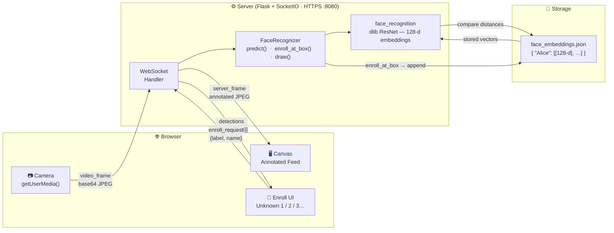
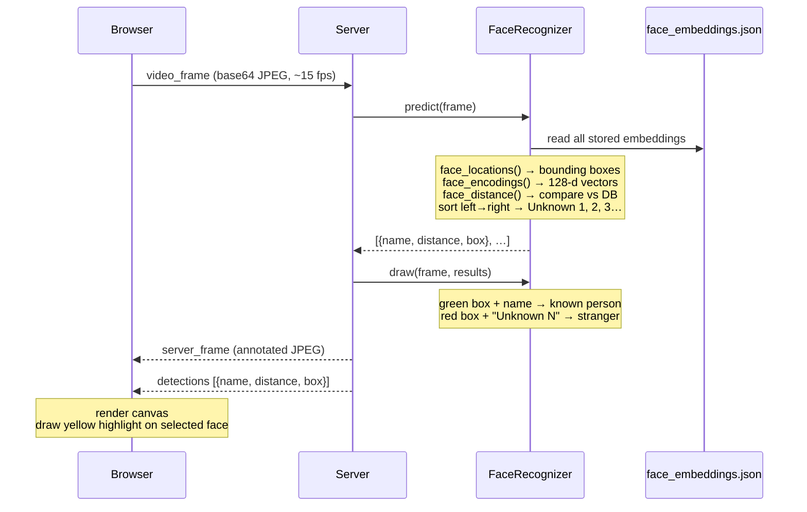
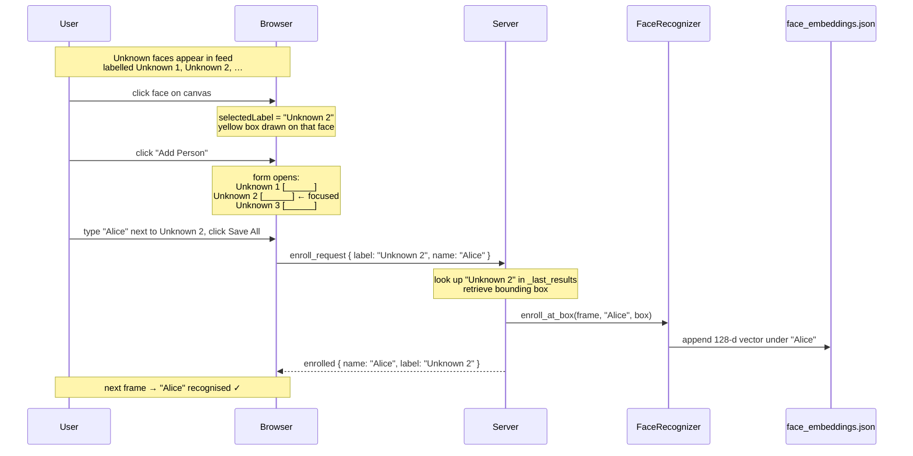
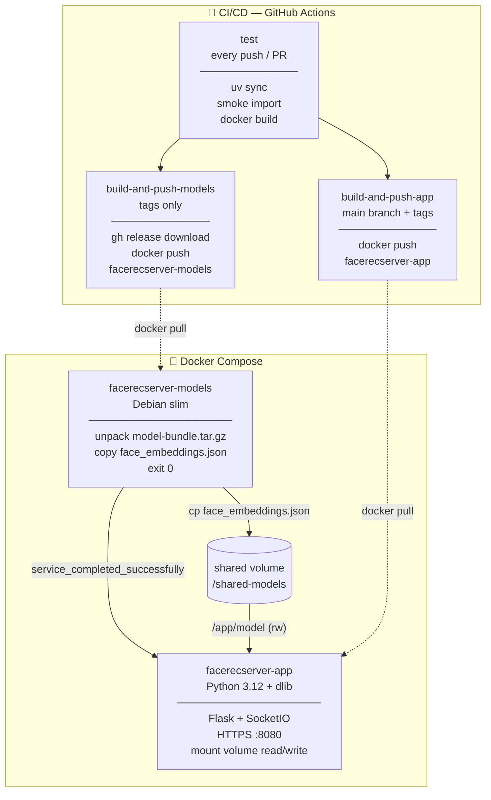
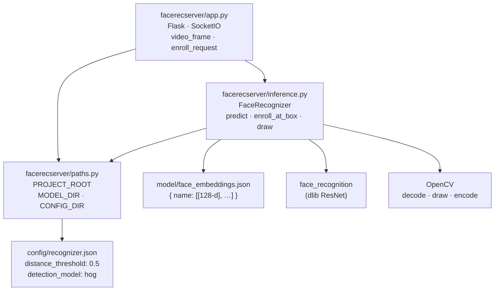

# FaceRecServer — Architecture Diagrams

---

## System Overview

```mermaid
flowchart LR
    subgraph Browser["🌐 Browser"]
        direction TB
        CAM["📷 Camera\ngetUserMedia()"]
        CANVAS["🖥 Canvas\nAnnotated Feed"]
        UI["👤 Enroll UI\nUnknown 1 / 2 / 3…"]
    end

    subgraph Server["⚙️ Server  (Flask + SocketIO · HTTPS :8080)"]
        direction TB
        WS["WebSocket\nHandler"]
        REC["FaceRecognizer\npredict()  ·  enroll_at_box()  ·  draw()"]
        DLIB["face_recognition\ndlib ResNet — 128-d embeddings"]
    end

    subgraph Storage["💾 Storage"]
        JSON["face_embeddings.json\n{ &quot;Alice&quot;: [[128-d], …] }"]
    end

    CAM      -- "video_frame\nbase64 JPEG"  -->  WS
    WS       -->                                  REC
    REC      -->                                  DLIB
    DLIB     -- "compare distances"          -->  JSON
    JSON     -- "stored vectors"             -->  DLIB
    REC      -- "enroll_at_box → append"    -->  JSON
    WS       -- "server_frame\nannotated JPEG" --> CANVAS
    WS       -- "detections\n[{name, box}]"  -->  UI
    UI       -- "enroll_request\n{label, name}" --> WS
```

---

## Recognition Flow (per frame)

```mermaid
sequenceDiagram
    participant B  as Browser
    participant S  as Server
    participant FR as FaceRecognizer
    participant DB as face_embeddings.json

    B  ->> S  : video_frame  (base64 JPEG, ~15 fps)
    S  ->> FR : predict(frame)
    FR ->> DB : read all stored embeddings
    note over FR : face_locations()  →  bounding boxes<br/>face_encodings()  →  128-d vectors<br/>face_distance()   →  compare vs DB<br/>sort left→right  →  Unknown 1, 2, 3…
    FR -->> S  : [{name, distance, box}, …]
    S  ->> FR : draw(frame, results)
    note over FR : green box + name  →  known person<br/>red box + "Unknown N"  →  stranger
    S  -->> B  : server_frame  (annotated JPEG)
    S  -->> B  : detections    [{name, distance, box}]
    note over B : render canvas<br/>draw yellow highlight on selected face
```

---

## Enrollment Flow

```mermaid
sequenceDiagram
    participant U  as User
    participant B  as Browser
    participant S  as Server
    participant FR as FaceRecognizer
    participant DB as face_embeddings.json

    note over U,B : Unknown faces appear in feed<br/>labelled Unknown 1, Unknown 2, …

    U  ->> B  : click face on canvas
    note over B : selectedLabel = "Unknown 2"<br/>yellow box drawn on that face
    U  ->> B  : click "Add Person"
    note over B : form opens:<br/>Unknown 1 [______]<br/>Unknown 2 [______]  ← focused<br/>Unknown 3 [______]

    U  ->> B  : type "Alice" next to Unknown 2, click Save All
    B  ->> S  : enroll_request  { label: "Unknown 2", name: "Alice" }
    note over S : look up "Unknown 2" in _last_results<br/>retrieve bounding box
    S  ->> FR : enroll_at_box(frame, "Alice", box)
    FR ->> DB : append 128-d vector under "Alice"
    S  -->> B  : enrolled  { name: "Alice", label: "Unknown 2" }
    note over B,U : next frame → "Alice" recognised ✓
```

---

## Docker Deployment

```mermaid
flowchart TB
    subgraph GH["🔁 CI/CD — GitHub Actions"]
        direction LR
        T["test\nevery push / PR\n─────────────\nuv sync\nsmoke import\ndocker build"]
        A["build-and-push-app\nmain branch + tags\n─────────────\ndocker push\nfacerecserver-app"]
        M["build-and-push-models\ntags only\n─────────────\ngh release download\ndocker push\nfacerecserver-models"]
        T --> A
        T --> M
    end

    subgraph DC["🐳 Docker Compose"]
        direction TB
        IMG_M["facerecserver-models\nDebian slim\n───────────────────\nunpack model-bundle.tar.gz\ncopy face_embeddings.json\nexit 0"]
        VOL[("shared volume\n/shared-models")]
        IMG_A["facerecserver-app\nPython 3.12 + dlib\n───────────────────\nFlask + SocketIO\nHTTPS :8080\nmount volume read/write"]

        IMG_M -- "service_completed_successfully" --> IMG_A
        IMG_M -- "cp face_embeddings.json" --> VOL
        VOL   -- "/app/model  (rw)" --> IMG_A
    end

    A -.->|"docker pull"| IMG_A
    M -.->|"docker pull"| IMG_M
```

---

## Component Dependency Map

```mermaid
flowchart TB
    APP["facerecserver/app.py\nFlask · SocketIO\nvideo_frame · enroll_request"]
    INF["facerecserver/inference.py\nFaceRecognizer\npredict · enroll_at_box · draw"]
    PAT["facerecserver/paths.py\nPROJECT_ROOT\nMODEL_DIR · CONFIG_DIR"]
    CFG["config/recognizer.json\ndistance_threshold: 0.5\ndetection_model: hog"]
    EMB["model/face_embeddings.json\n{ name: [[128-d], …] }"]
    FR["face_recognition\n(dlib ResNet)"]
    CV["OpenCV\ndecode · draw · encode"]

    APP --> INF
    APP --> PAT
    INF --> PAT
    INF --> FR
    INF --> CV
    INF --> EMB
    PAT --> CFG
```
